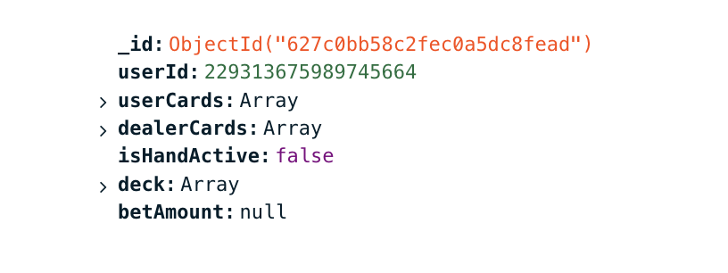
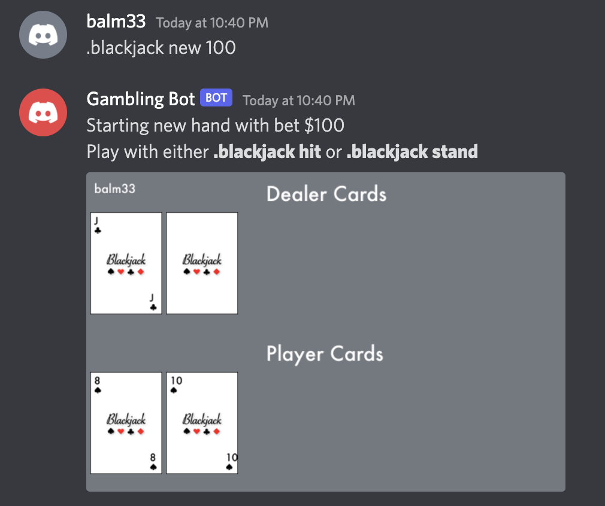
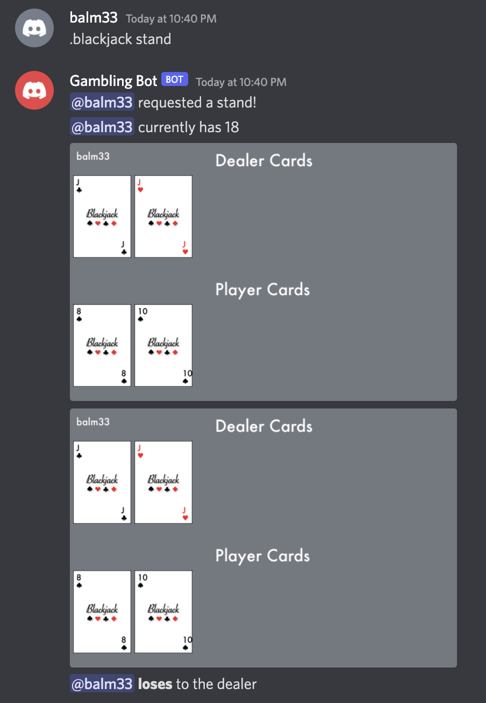

# DiscordGamblingBot
## A simple bot for the Discord app that lets you bet (fake) money and gamble

- Features
  - [MongoDB Integration](#mongodb-integration)
  - [General Commands](#general-commands)
  - [Games](#games)
    - [Blackjack](#blackjack) 

# MongoDB Integration
All of the data storage is handled by a database hosted by [MongDB](https://mongodb.com). The data for money is stored in a seperate collection from the blackjack data, so that currency can be universal if I decide to add more games to the bot.
#

How player blackjack data is stored
#
Using the functions apart of [db.py](db.py), the main bot program is able to read and write data to the database, independently interacting with money and game stats.

# General Commands
At any point a user can user
> .balance

to check the current balance of their account. They can also use
> .broke

to be given $100 from the bot, only if they run out of money, or have never had any to begin with.

# Games
## Blackjack
The bot supports using discord chat commands in a server to play blackjack against a dealer. Each user has their own 104 card (2 decks) deck, that is automatically refilled and shuffled when cards are low. A user can bet some of their virtual money to be put on the line, and will either win more money or lose their bet based upon how they perform. Additionally, images are procedurally generated using [genImage.py](genImage.py), which uses [Pillow](https://pillow.readthedocs.io/en/stable/) to combine source images that I created using [Gimp](https://www.gimp.org/), creating cards representing those that are actually in the player's and dealer's hands.

#
A player can use the bot by first typing
> .blackjack new BET_AMOUNT

where BET_AMOUNT is the amount of money that they would like to wager. The bot will only let them bet money that they currently possess, and nothing more.

A player starting a new round
#
They can then either choose to hit
> .blackjack hit

stand
> .blackjack stand

or double
>.blackjack double

A player stands

#
> Created by Brendan Alm